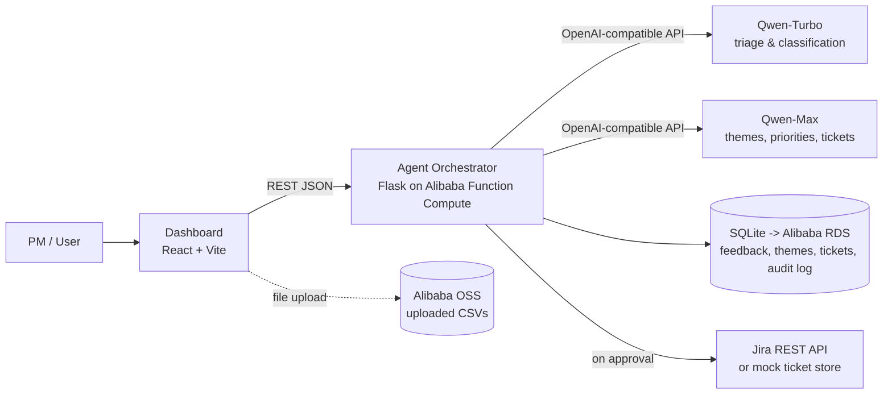

# Signal — Architecture & Flow Specification

> The source of truth for what Signal is and how it's built.
> If code and this document disagree, this document wins — or gets consciously updated.

**One-liner:** An AI agent that turns raw product feedback (reviews, tickets, NPS
comments) into a prioritized, evidence-backed roadmap — drafted autonomously,
approved by a human PM. Hackathon entry: Qwen Cloud Global AI Hackathon, Track 4
(Autopilot Agent).

---

## 1. System Architecture



### Components

| Component | Tech | Responsibility |
|---|---|---|
| **Dashboard (frontend)** | React + Vite, plain CSS or Tailwind | Upload screen, pipeline progress, theme explorer, approval queue, audit trail. Talks to backend via REST/JSON only. No business logic in the frontend. |
| **Agent orchestrator (backend)** | Python 3.10+, Flask, deployed on Alibaba Function Compute (web function, gunicorn, port 9000) | Owns the entire pipeline. Receives uploads, runs the 4-stage agent pipeline, persists everything, exposes the API below. |
| **Qwen models** | Model Studio, OpenAI-compatible endpoint | qwen-turbo = cheap high-volume steps (triage). qwen-max = reasoning-heavy steps (themes, priorities, tickets). Model choice per step is deliberate and should never be flattened to one model. |
| **Storage** | SQLite for local dev → Alibaba RDS (MySQL) for deployment. SQLAlchemy as the ORM so the swap is a connection-string change. | All entities below + audit log. |
| **File storage** | Local folder for dev → Alibaba OSS in deployment | Raw uploaded CSVs. |
| **Ticket destination** | Jira Cloud REST API (free tier). Fallback: `MockTicketStore` table behind the same interface. | Where approved tickets land. Build behind an interface (`TicketSink`) so Jira and mock are swappable. |

### Non-negotiable principles

1. **Human-in-the-loop:** no ticket is ever created externally without explicit user approval. There is no "auto-approve" mode.
2. **Evidence chain:** every theme and every ticket must be traceable to specific feedback item IDs. The agent never asserts without receipts.
3. **Audit everything:** every agent decision (classification, grouping, scoring, drafting) writes an audit log row before the pipeline proceeds.
4. **Distrust model output:** every Qwen response is validated (JSON parse + schema check). Malformed output triggers one retry with a corrective prompt, then graceful failure logged to the audit trail — never a crash.

---

## 2. The Agent Pipeline (core flow)

Triggered when a user uploads a CSV. Runs as a background job; the frontend polls
for progress. Each stage writes its outputs and audit rows before the next begins.

```
Stage 0: INGEST
  Parse CSV -> validate columns (id optional, source, text, [date], [rating])
  -> create FeedbackItem rows with status=pending

Stage 1: TRIAGE  (qwen-turbo, items batched ~10 per call)
  For each item: classify into bug_report | feature_request | complaint | praise | noise
  + one-sentence neutral summary + confidence 0-1
  -> noise and exact duplicates marked excluded
  -> audit row per batch

Stage 2: THEME SYNTHESIS  (qwen-max, all non-excluded summaries in one or few calls)
  Group items into themes representing the same underlying user problem.
  Merge differently-phrased duplicates. Every item_id in a theme MUST exist in input
  (validate: reject hallucinated IDs, retry once).
  -> Theme rows with item_id lists  -> audit row

Stage 3: PRIORITIZATION  (qwen-max)
  Score each theme P1-P4 using frequency, severity, breadth across sources.
  Output rationale (2-3 sentences citing evidence counts) + evidence_item_ids.
  P1 must be rare; prompt instructs conservatism.
  -> update Theme rows  -> audit row

Stage 4: TICKET DRAFTING  (qwen-max, top themes only — P1s and P2s)
  Draft per theme: title, user story ("As a..., I want..., so that..."),
  3-5 testable acceptance criteria, severity.
  -> DraftTicket rows with status=pending_review  -> audit row

END STATE: pipeline_run.status = awaiting_review
Nothing has left the system. The human takes over.
```

---

## 3. Data Model

```
PipelineRun:   id, filename, started_at, finished_at,
               status (ingesting|triaging|theming|prioritizing|drafting|awaiting_review|complete|failed),
               counts_json (items_total, excluded, themes, tickets)

FeedbackItem:  id, run_id (FK), source (app_store|support|nps|other), text, date?, rating?,
               category, summary, confidence, excluded (bool), exclusion_reason?

Theme:         id, run_id (FK), title, problem_statement, priority (P1-P4),
               rationale, item_ids (JSON array — the evidence chain),
               sources_breakdown (JSON, e.g. {"app_store": 9, "support": 5})

DraftTicket:   id, theme_id (FK), title, user_story, acceptance_criteria (JSON array),
               severity, status (pending_review|approved|rejected),
               edited_by_human (bool), external_ref? (Jira key once created)

AuditEvent:    id, run_id (FK), timestamp, stage, action, detail_json,
               model_used?, tokens_in?, tokens_out?
               (human actions are audited too: action=human_approved / human_edited / human_rejected)
```

---

## 4. API Contract (backend endpoints)

| Method & path | Purpose | Notes |
|---|---|---|
| `GET /health` | liveness check | exists already (hello world) |
| `POST /runs` | upload CSV, start pipeline | multipart file; returns `run_id` |
| `GET /runs/:id` | run status + counts | frontend polls this during processing |
| `GET /runs/:id/themes` | all themes with priorities & evidence counts | |
| `GET /themes/:id` | one theme + its full evidence items | the evidence-chain view |
| `GET /runs/:id/tickets` | draft tickets awaiting review | the approval queue |
| `PATCH /tickets/:id` | edit a draft (any field) | sets edited_by_human=true, audited |
| `POST /tickets/:id/approve` | approve → create in Jira/mock | returns external_ref; audited |
| `POST /tickets/:id/reject` | reject with optional reason | audited |
| `GET /runs/:id/audit` | full audit trail, newest first | the trust page |

All responses JSON. Errors: `{"error": str, "detail": str}` with proper status codes.

---

## 5. User Flow & Screens

**Persona:** a PM with a fresh export of mixed feedback who wants a defensible
prioritized backlog in minutes, not days.

```
[1. Upload] -> [2. Processing] -> [3. Themes] -> [4. Theme detail] -> [5. Approval queue] -> [6. Audit trail]
```

### Screen 1 — Upload (home)
Drag-and-drop CSV + expected-format hint + "use sample dataset" button (loads the
demo CSV — also makes demos one-click). Past runs listed below. → starts run, goes to 2.

### Screen 2 — Processing
Live pipeline progress: the five stages as steps, current counts ("147 items triaged,
12 excluded as noise…"). Polls `GET /runs/:id`. Auto-advances to 3 when awaiting_review.
*This screen is demo gold — design it to be watched.*

### Screen 3 — Themes overview
Themes as cards sorted by priority. Each card: title, P-badge, evidence count
("14 items · 3 sources"), one-line problem statement. Click → 4.

### Screen 4 — Theme detail (the evidence chain)
Problem statement, priority + full rationale, sources breakdown, and the complete
list of underlying feedback items (original text + category + summary). This screen
IS the trust argument. Button: "view draft ticket" → 5.

### Screen 5 — Approval queue (the checkpoint)
Draft tickets as expandable cards: title, user story, acceptance criteria, severity,
link back to theme. Actions per ticket: **Edit** (inline), **Approve** (→ Jira/mock,
shows returned ticket key), **Reject** (reason optional). Approved/rejected move to
a "decided" section. *Track 4's human-in-the-loop requirement, made visible.*

### Screen 6 — Audit trail
Chronological log of every agent decision and human action, filterable by stage.
Plain, readable language ("Stage 2: merged items #41, #87 into theme 'Slow dashboard
load' — qwen-max, 1,204 tokens").

Design notes: clean, calm, confident — this is a PM tool, not a developer console.
Mobile layout out of scope.

---

## 6. Build Order (maps to playbook phases)

1. **Thinnest thread:** POST /runs accepting one hardcoded item → Stage 1 only →
   GET themes returning raw classifications → ugly page showing them.
2. **Pipeline depth:** full CSV ingest, batching, Stages 2-4, validation/retry,
   audit logging. (Most prompt-iteration time lives here.)
3. **Product layer:** real screens 1-6, Jira integration behind TicketSink, polish.
4. **Freeze & ship:** bugs and words only.

## 7. Out of Scope (do not build)

Auth/login, multi-user, live source integrations (the CSV stands in for all),
streaming ingestion, notifications, mobile. New ideas → FUTURE.md, always.
